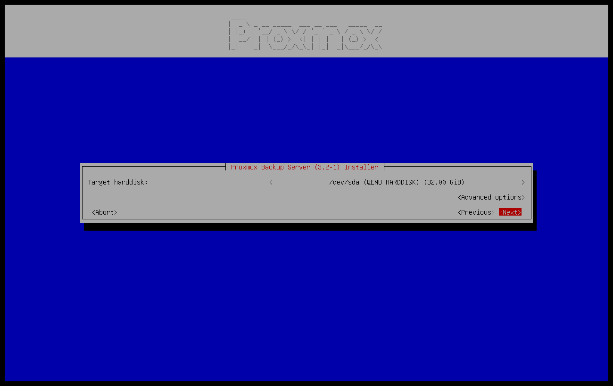
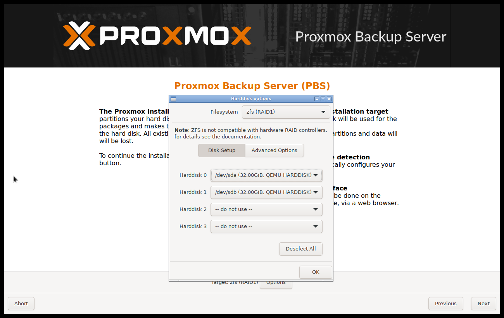
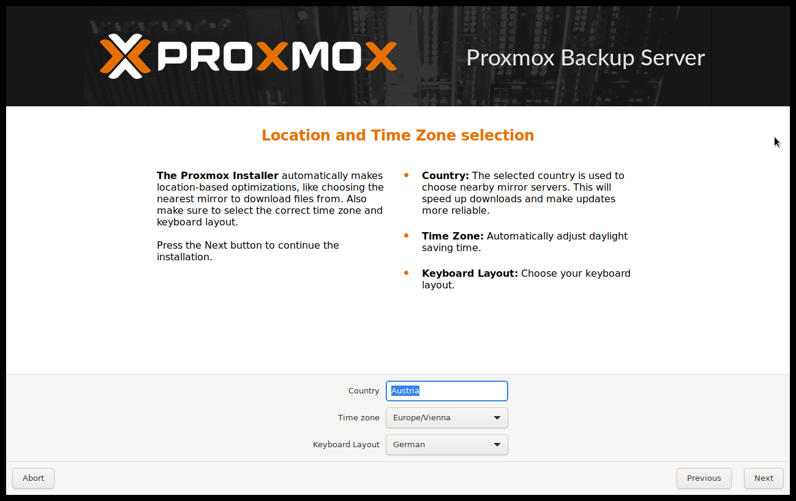
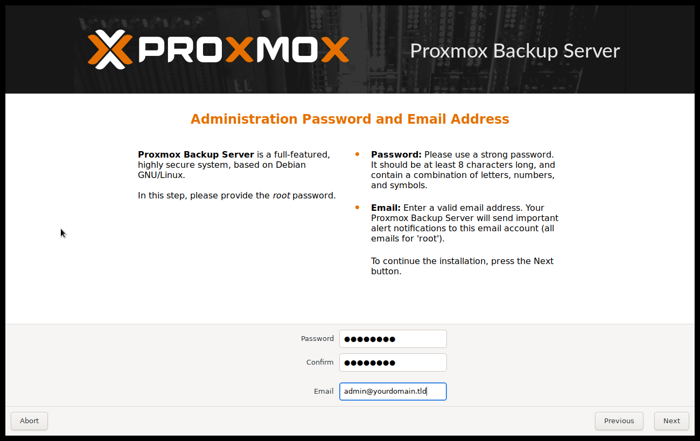
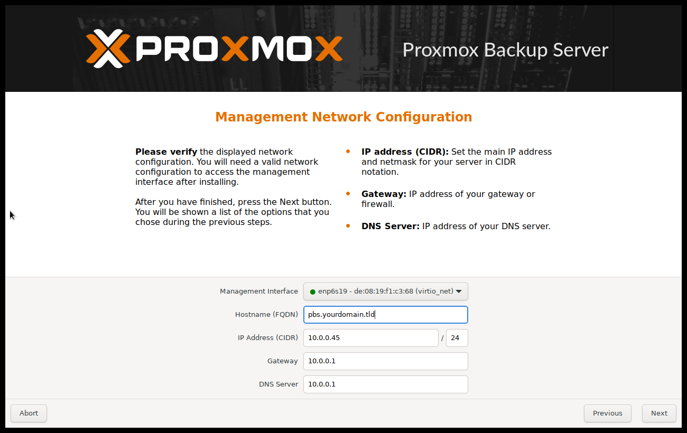
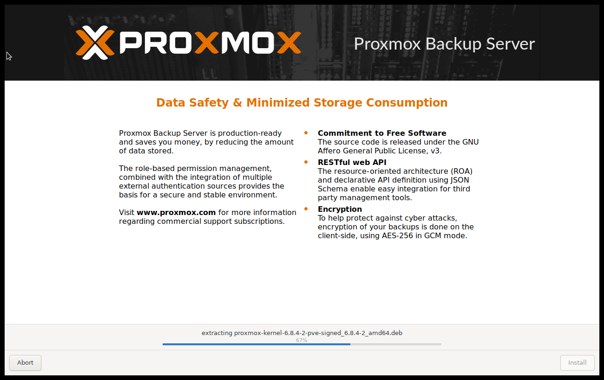
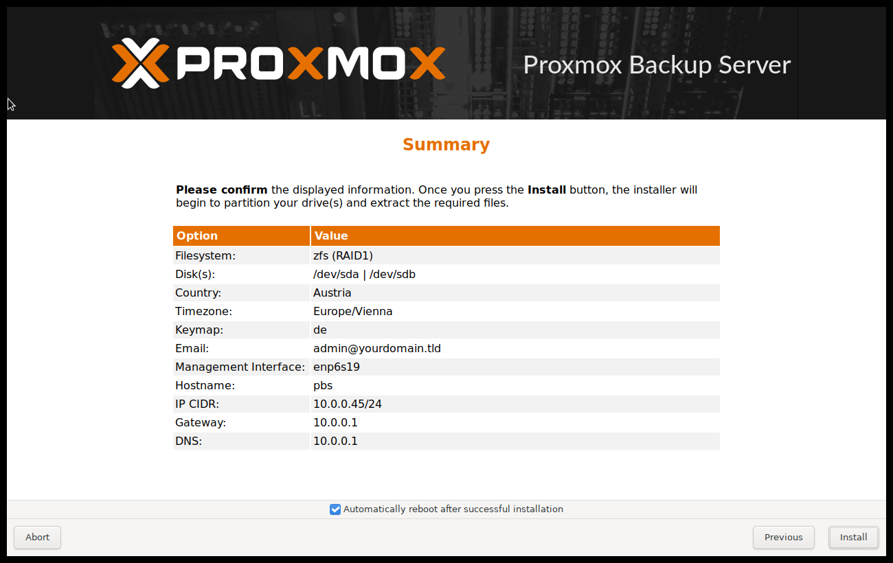

.. _using_the_installer:

Install `Proxmox Backup`_ Server using the Installer
~~~~~~~~~~~~~~~~~~~~~~~~~~~~~~~~~~~~~~~~~~~~~~~~~~~~

Download the ISO from |DOWNLOADS|.
It includes the following:

* The Proxmox Backup Server installer, which partitions the local
  disk(s) with ext4, xfs or ZFS, and installs the operating system

* Complete operating system (Debian Linux, 64-bit)

* Proxmox Linux kernel with ZFS support

* Complete toolset to administer backups and all necessary resources

* Web-based management interface

.. note:: Any existing data on the selected drives will be overwritten
   during the installation process. The installer does not add boot
   menu entries for other operating systems.

Please insert the :ref:`installation_medium` (for example, USB flash
drive or DVD) and boot from it.

.. note:: You may need to go into your server's firmware settings, to
   enable booting from your installation medium (for example, USB) and
   set the desired boot order. When booting an installer prior to
   `Proxmox Backup`_ Server version 3.1, Secure Boot needs to be
   disabled.

.. image:: images/screenshots/pbs-installer-grub-menu.png
  :target: _images/pbs-installer-grub-menu.png
  :align: right
  :alt: Proxmox Backup Server Installer GRUB Menu

After choosing the correct entry (for example, *Boot from USB*) the
Proxmox Backup Server menu will be displayed, and one of the following
options can be selected:

**Install Proxmox Backup Server (Graphical)**

Starts the normal installation.

TIP: It's possible to use the installation wizard with a keyboard only. Buttons
can be clicked by pressing the ``ALT`` key combined with the underlined character
from the respective button. For example, ``ALT + N`` to press a ``Next`` button.

**Install Proxmox Backup Server (Console)**

Starts the terminal-mode installation wizard. It provides the same overall
installation experience as the graphical installer, but has generally better
compatibility with very old and very new hardware.

**Install Proxmox Backup Server (Terminal UI, Serial Console)**

Starts the terminal-mode installation wizard, additionally setting up the Linux
kernel to use the (first) serial port of the machine for in- and output. This
can be used if the machine is completely headless and only has a serial console
available.

Both modes use the same code base for the actual installation process to
benefit from more than a decade of bug fixes and ensure feature parity.

TIP: The *Console* or *Terminal UI* option can be used in case the graphical
installer does not work correctly, due to e.g. driver issues. See also
:ref:`nomodeset_kernel_param`.

**Advanced Options: Install Proxmox Backup Server (Debug Mode)**

Starts the installation in debug mode. A console will be opened at several
installation steps. This helps to debug the situation if something goes wrong.
To exit a debug console, press ``CTRL-D``. This option can be used to boot a
live system with all basic tools available. You can use it, for example, to
repair a degraded ZFS *rpool* or fix the :ref:`chapter-systembooting` for an
existing Proxmox Backup Server setup.

**Advanced Options: Install Proxmox Backup Server (Terminal UI, Debug Mode)**

Same as the graphical debug mode, but preparing the system to run the
terminal-based installer instead.

**Advanced Options: Install Proxmox Backup Server (Serial Console Debug Mode)**

Same the terminal-based debug mode, but additionally sets up the Linux kernel to
use the (first) serial port of the machine for in- and output.

**Advanced Options: Rescue Boot**

With this option you can boot an existing installation. It searches all attached
hard disks. If it finds an existing installation, it boots directly into that
disk using the Linux kernel from the ISO. This can be useful if there are
problems with the bootloader (GRUB/``systemd-boot``) or the BIOS/UEFI is unable
to read the boot block from the disk.

**Advanced Options: Test Memory (memtest86+)**

Runs *memtest86+*. This is useful to check if the memory is functional and free
of errors. Secure Boot must be turned off in the UEFI firmware setup utility to
run this option.

You normally select *Install Proxmox Backup Server (Graphical)* to start the
installation.

The first step is to read our EULA (End User License Agreement). Following this,
you can select the target hard disk(s) for the installation.

.. caution:: By default, the whole server is used and all existing data is
   removed. Make sure there is no important data on the server before proceeding
   with the installation.

The *Options* button lets you select the target file system, which defaults to
``ext4``. The installer uses LVM if you select ``ext4`` or ``xfs`` as a file
system, and offers additional options to restrict LVM space (see :ref:`below
<advanced_lvm_options>`).

Proxmox Backup Server can also be installed on ZFS. As ZFS offers several
software RAID levels, this is an option for systems that don't have a hardware
RAID controller. The target disks must be selected in the *Options* dialog. More
ZFS specific settings can be changed under :ref:`Advanced Options
<advanced_zfs_options>`.

.. warning:: ZFS on top of any hardware RAID is not supported and can result in
   data loss.

The next page asks for basic configuration options like your location, time
zone, and keyboard layout. The location is used to select a nearby download
server, in order to increase the speed of updates. The installer is usually able
to auto-detect these settings, so you only need to change them in rare
situations when auto-detection fails, or when you want to use a keyboard layout
not commonly used in your country.

Next the password of the superuser (``root``) and an email address needs to be
specified. The password must consist of at least 5 characters. It's highly
recommended to use a stronger password. Some guidelines are:

|
|

- Use a minimum password length of at least 12 characters.

- Include lowercase and uppercase alphabetic characters, numbers, and symbols.

- Avoid character repetition, keyboard patterns, common dictionary words,
  letter or number sequences, usernames, relative or pet names, romantic links
  (current or past), and biographical information (for example ID numbers,
  ancestors' names or dates).

The email address is used to send notifications to the system administrator.
For example:

- Information about available package updates.

- Error messages from periodic *cron* jobs.

All those notification mails will be sent to the specified email address.

The last step is the network configuration. Network interfaces that are *UP*
show a filled circle in front of their name in the drop down menu. Please note
that during installation you can either specify an IPv4 or IPv6 address, but not
both. To configure a dual stack node, add additional IP addresses after the
installation.

The next step shows a summary of the previously selected options. Please
re-check every setting and use the *Previous* button if a setting needs to be
changed.

After clicking *Install*, the installer will begin to format the disks and copy
packages to the target disk(s). Please wait until this step has finished; then
remove the installation medium and restart your system.

Copying the packages usually takes several minutes, mostly depending on the
speed of the installation medium and the target disk performance.

When copying and setting up the packages has finished, you can reboot the
server. This will be done automatically after a few seconds by default.

Installation Failure
^^^^^^^^^^^^^^^^^^^^

If the installation failed, check out specific errors on the second TTY
(``CTRL + ALT + F2``) and ensure that the systems meets the
:ref:`minimum requirements <minimum_system_requirements>`.

If the installation is still not working, look at the :ref:`how to get help
chapter <get_help>`.

Accessing the Management Interface Post-Installation
^^^^^^^^^^^^^^^^^^^^^^^^^^^^^^^^^^^^^^^^^^^^^^^^^^^^

.. image:: images/screenshots/pbs-gui-login-window.png
  :target: _images/pbs-gui-login-window.png
  :align: right
  :alt: Proxmox Backup Server - Management interface login dialog

After a successful installation and reboot of the system you can use the Proxmox
Backup Server web interface for further configuration.

- Point your browser to the IP address given during the installation and port
  8007, for example: https://pbs.yourdomain.tld:8007

- Log in using the ``root`` (realm *Linux PAM standard authentication*) username
  and the password chosen during installation.

- Upload your subscription key to gain access to the Enterprise repository.
  Otherwise, you will need to set up one of the public, less tested package
  repositories to get updates for security fixes, bug fixes, and new features.

- Check the IP configuration and hostname.

- Check the timezone.

.. _advanced_lvm_options:

Advanced LVM Configuration Options
^^^^^^^^^^^^^^^^^^^^^^^^^^^^^^^^^^

The installer creates a Volume Group (VG) called ``pbs``, and additional Logical
Volumes (LVs) called ``root`` and ``swap``, if ``ext4`` or ``xfs`` as filesystem
is used. To control the size of these volumes use:

- *hdsize*

    Defines the total hard disk size to be used. This way you can reserve free
    space on the hard disk for further partitioning.

- *swapsize*

    Defines the size of the ``swap`` volume. The default is the size of the
    installed memory, minimum 4 GB and maximum 8 GB. The resulting value cannot
    be greater than ``hdsize/8``.

    If set to ``0``, no ``swap`` volume will be created.

- *minfree*

    Defines the amount of free space that should be left in the LVM volume group
    ``pbs``. With more than 128GB storage available, the default is 16GB,
    otherwise ``hdsize/8`` will be used.

.. _advanced_zfs_options:

Advanced ZFS Configuration Options
^^^^^^^^^^^^^^^^^^^^^^^^^^^^^^^^^^

The installer creates the ZFS pool ``rpool``, if ZFS is used. No swap space is
created but you can reserve some unpartitioned space on the install disks for
swap. You can also create a swap zvol after the installation, although this can
lead to problems (see :ref:`ZFS swap notes <zfs_swap>`).

- *ashift*

    Defines the *ashift* value for the created pool. The *ashift* needs to be
    set at least to the sector-size of the underlying disks (2 to the power of
    *ashift* is the sector-size), or any disk which might be put in the pool
    (for example the replacement of a defective disk).

- *compress*

    Defines whether compression is enabled for ``rpool``.

- *checksum*

    Defines which checksumming algorithm should be used for ``rpool``.

- *copies*

    Defines the *copies* parameter for ``rpool``. Check the ``zfs(8)`` manpage
    for the semantics, and why this does not replace redundancy on disk-level.

- *hdsize*

    Defines the total hard disk size to be used. This is useful to save free
    space on the hard disk(s) for further partitioning (for example, to create a
    swap partition). *hdsize* is only honored for bootable disks, that is only
    the first disk or mirror for RAID0, RAID1 or RAID10, and all disks in
    RAID-Z[123].

ZFS Performance Tips
^^^^^^^^^^^^^^^^^^^^

ZFS works best with a lot of memory. If you intend to use ZFS make sure to have
enough RAM available for it. A good calculation is 4GB plus 1GB RAM for each TB
of raw disk space.

ZFS can use a dedicated drive as write cache, called the ZFS Intent Log (ZIL).
Use a fast drive (SSD) for it. It can be added after installation with the
following command:

.. code-block:: console

    # zpool add <pool-name> log </dev/path_to_fast_ssd>

.. _nomodeset_kernel_param:

Adding the ``nomodeset`` Kernel Parameter
^^^^^^^^^^^^^^^^^^^^^^^^^^^^^^^^^^^^^^^^^

Problems may arise on very old or very new hardware due to graphics drivers. If
the installation hangs during boot, you can try adding the ``nomodeset``
parameter. This prevents the Linux kernel from loading any graphics drivers and
forces it to continue using the BIOS/UEFI-provided framebuffer.

On the Proxmox Backup Server bootloader menu, navigate to *Install Proxmox
Backup Server (Console)* and press ``e`` to edit the entry. Using the arrow
keys, navigate to the line starting with ``linux``, move the cursor to the end
of that line and add the parameter ``nomodeset``, separated by a space from the
pre-existing last parameter.

Then press ``Ctrl-X`` or ``F10`` to boot the configuration.
